This update will make your **README.md** the definitive guide for your project, explaining not just the *how* but the *why* behind your architecture. It includes high-level diagrams using Mermaid (which renders directly in GitHub) to impress judges and technical evaluators.

---

### **Updated `README.md` Sections**

Add these sections after your project description to provide a deep technical dive.

## 🏗️ System Architecture

SkillChain India follows a **decentralized, 4-layer architecture** designed for high throughput, data integrity, and national-scale interoperability.

---

## 📘 Understanding the Core Logic

### 1. The Hashing Mechanism (The Digital Fingerprint)

To maintain **privacy** while ensuring **authenticity**, we do not store learner personal data on the blockchain.

* **The Process:** We concatenate the learner's details (Name, ID, Course, Date) into a single string and pass it through a **Keccak-256** hash function.
* **The Result:** A unique 64-character string. If a single character in the certificate is changed, the hash will fail to match the record on the ledger, instantly flagging the certificate as forged.

### 2. IPFS Integration (Decentralized Storage)

Storing large PDF files on a blockchain is prohibitively expensive.

* **Our Solution:** We store the visual certificate on **IPFS (InterPlanetary File System)**.
* **The Link:** IPFS returns a **Content Identifier (CID)**. This CID is stored in the smart contract metadata, ensuring that the visual document and the blockchain record are permanently linked.

### 3. Verification Workflow (The QR Code Loop)

```mermaid
sequenceDiagram
    participant E as Employer (Scanner)
    participant V as Verification Gateway
    participant B as Polygon Blockchain
    participant I as IPFS

    E->>V: Scans QR Code on Certificate
    V->>B: Queries TokenID & Data Hash
    B-->>V: Returns Immutable Record
    V->>V: Recalculates Hash from scan data
    alt Hashes Match
        V->>I: Fetch Original PDF via CID
        V-->>E: Display "VERIFIED ✅" + Original Document
    else Hashes Mismatch
        V-->>E: Display "INVALID/TAMPERED ❌"
    end

```

---

## 🇮🇳 National Integration Strategy

SkillChain India is built as a **"Trust Layer"** for the existing India Stack:

| Platform | Integration Method | Purpose |
| --- | --- | --- |
| **DigiLocker** | API / Webhooks | Push verified blockchain credentials directly to the citizen's vault. |
| **Skill India Digital** | OAuth 2.0 / SSO | Synchronize learner profiles and certification history. |
| **NCRF (Credit Bank)** | Smart Contract Events | Automatically update academic credit balances upon certification. |

---

## 🛠️ Security Standards

* **Cryptography:** SHA-256 for data hashing and ECDSA for transaction signing.
* **Privacy:** Off-chain storage of PII (Personally Identifiable Information) to comply with **DPDP Act 2023**.
* **Access Control:** Role-Based Access Control (RBAC) ensuring only NCVET-authorized nodes can "mint" certificates.

---
